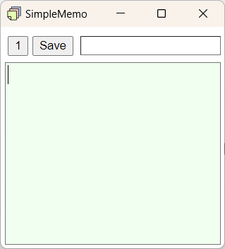

# SimpleMemo
Electron製のシンプルなメモ帳


## 3つの特徴
### 1. 3つのメモを切り替え
　１つのウィンドウで３つのメモをとることができます。メモの切り替えは左上のボタンをクリックするか、ショートカットキーで可能です。

### 2. 常に手前に表示
　常に手前に表示できます。ブラウザなどを全画面にしたままメモの内容を入力できるので、面倒なウィンドウ操作が必要ありません。この機能はオフにできます。

### 3. 保存先を指定せずに保存
　保存先を事前に設定することで、メモのタイトルを決めるだけで簡単に保存できます。

## 機能
### メモの保存
　メモを保存する際、タイトルのテキストボックスが発光します。色の意味は下記となります。
　- 青：初回保存
　- 緑：上書き保存
　- 橙：読み込んだファイルの上書き保存

### ファイル読み込み
　テキストファイルの読み込みに対応しています。読み込ませるには、ファイルをドラッグアンドドロップしてください。  

読み込んだファイルは、メモのタイトルに拡張子がついた状態で表示されます。文字コードは、UTF8, UTF16, JIS, SJIS, EUCJPに対応しており、自動判別も可能です。

### ショートカットキー
　下記のショートカットキーが使用可能です。
　- Ctrl + C：コピー
　- Ctrl + V: 貼り付け
　- Ctrl + X: 切り取り
　- Ctrl + S：保存
　- Ctrl + T: タイトルと本文テキストのカーソル移動
　- Ctrl + L: メモのロック
　- Ctrl + Tab: 次のメモ
　- Ctrl + Shift + Tab: 前のメモ
　- Ctrl + Shift + .(ピリオド): フォントサイズ拡大
　- Ctrl + Shift + ,: フォントサイズ縮小

## インストール方法
### Windows
Releasesにあるビルド済みバイナリを任意の場所に展開してください。  
`simplememo.exe` を実行するとアプリが起動します。  
アンインストールは展開したファイルごと削除してください。

### Mac, Linux
バイナリは用意していないため、ビルドしてください。

## ビルド方法
### Windows
```
cd {リポジトリの場所}
npm install     // 必要なパッケージのインストール
npm run start   // アプリ起動
npm run build   // Windows用にビルド
```

### Mac, Linux
未確認  

## 既知のバグ
記載予定

## 変更履歴
v1.0.0
 初版
